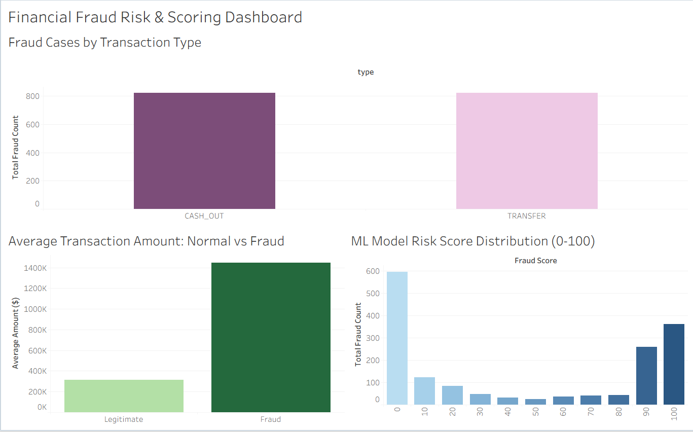

# Financial Fraud Detection & Risk Scoring Dashboard

Uçtan uca finansal dolandırıcılık tespiti (Fraud Detection), risk olasılık skorlaması ve Tableau iş zekası karar paneli çalışması.

---

## Dashboard Önizlemesi

[](https://public.tableau.com/views/FinancialFraudDetectionRiskScoring/FinancialFraudRiskScoringDashboard?:language=en-US&:sid=&:redirect=auth&:display_count=n&:origin=viz_share_link)

> Canlı Tableau Paneli: [Tableau Public Üzerinde İnceleyin](https://public.tableau.com/views/FinancialFraudDetectionRiskScoring/FinancialFraudRiskScoringDashboard?:language=en-US&:sid=&:redirect=auth&:display_count=n&:origin=viz_share_link)

---

## Proje Amacı ve İş Problemi

* **Problem:** Finansal işlemlerde dolandırıcılık vakalarının nadir görülmesi (Imbalanced Data) sebebiyle standart modeller ya yüksek oranda hatalı alarm (düşük Precision) üretmekte ya da dolandırıcıları tespit edememektedir (düşük Recall).
* **Yaklaşım:** İşlemleri yalnızca 0 veya 1 olarak sınıflandırmak yerine, her işleme **0-100 aralığında bir Risk Skoru** atanmıştır.
* **Karar Mekanizması:**
  * **90 - 100:** Doğrudan işlem blokajı.
  * **40 - 80:** İki adımlı doğrulama (SMS/2FA) tetikleme.
  * **0 - 40:** Kesintisiz meşru işlem onayı.

---

## Kullanılan Araçlar ve Yöntemler

* **Veri Analizi:** Python (pandas, numpy)
* **Makine Öğrenmesi:** scikit-learn (Logistic Regression, StandardScaler, One-Hot Encoding)
* **Model Çıktısı:** `predict_proba` ile hesaplanan olasılık skorları
* **İş Zekası:** Tableau Desktop, Tableau Public

---

## Temel Bulgular

1. Dolandırıcılık vakaları yalnızca `CASH_OUT` ve `TRANSFER` işlem türlerinde toplanmaktadır.
2. Dolandırıcılık işlemlerindeki ortalama tutar (~1.45M $), normal işlemlere göre yaklaşık 5 kat yüksektir.
3. Model, dolandırıcılık vakalarının önemli bir bölümünü 90-100 risk bandında başarıyla kümelemiştir.

---

## Dosya Yapısı

```text
├── Fraud_Scorecard_Model.ipynb      # Veri analizi, temizleme ve modelleme adımları
├── dashboard_preview.png            # Dashboard ekran görüntüsü
└── README.md                        # Proje dokümantasyonu
